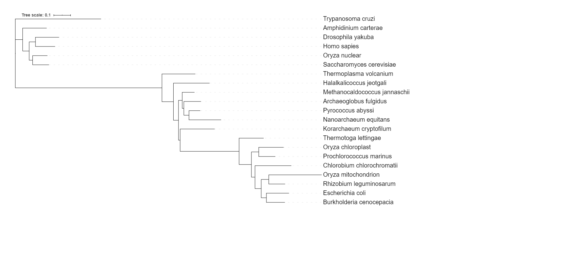
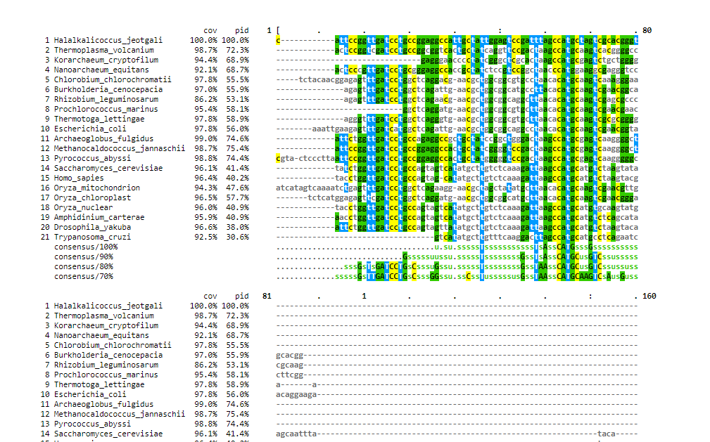

```{r setup, include=FALSE}
knitr::opts_chunk$set(echo = TRUE)
```

## Sequence Alignment, Phylogenetic Analysis and Tree Visualization

*****

#### **Sequence Alignment Background**

##### Sequence Alignment is one of the most fundamental operations of bioinformatics. Sequence alignments are used to decide if genes or proteins are related functionally, structurally and evolutionarily. It is also at the core of sequence search methods such as BLAST.

##### There are two principal methods of pair-wise sequence alignment

* **Dot matrix analysis:** This method involves constructing a matrix with one of the sequences to be compared running horizontally across the bottom, and the other running vertically along the left-hand side. Each entry of the matrix is a measure of similarity of those two residues on the horizontal and vertical sequence. The simplest scoring system, distinguishes only between identical (dots) and non-identical (blank) residues.The dot plot displays graphically any possible sequence alignments as diagonals on the matrix. Insertions, deletions, direct repeats and inverted repeats can be visually detected on a dot plot. Dot plot can also detect regions of RNA that are self-complementary and thus might form secondary structure.

* **The dynamic programming (or DP) algorithm.:** The dynamic programming algorithm is at the heart of many bioinformatics programs including BLAST (sequence searching), FASTA (sequence searching), CLUSTALW (multiple sequence alignmnet), HMMER (profile searching), GENSCAN (gene finding), MFOLD (RNA folding), and PHYLIP (phylogenetic analysis). Dynamic programing was first used for global alignment of protein sequences. 

* **Word or k-tuple methods (such as those used in BLAST and FASTA - we will discuss later)**


*****

### Multiple Sequence Alignment

Progressive alignment methods are efficient enough to implement on a large scale for many (100s to 1000s) sequences. Progressive alignment services are commonly available on publicly accessible web servers so users need not locally install the applications of interest. The most popular progressive alignment method has been the **Clustal** family Different portals or implementations can vary in user interface and make different parameters accessible to the user. Clustal Omega is used extensively for phylogenetic tree construction.

The basic steps in **Clustal** are:

1. Calculate all possible pairwise alignments, record the score for each pair
2. Calculate a guide tree based on the pairwise distances (algorithm: Neighbor Joining)
3. Find the two most closely related sequences
4. Align these sequences (algorithm: Smith-Waterman).
* Calculate a consensus of this alignment
* Replace the two sequences with the consensus
* Find the two next-most closely related sequences (one of these could be a previously determined consensus sequence).
* Iterate until all sequences have been aligned
5. Expand the consensus sequences with the (gapped) original sequences
6. Report the multiple sequence alignment

**Pairwise Sequence Alignment:** is used to identify regions of similarity that may indicate functional, structural and/or evolutionary relationships between two biological sequences (protein or nucleic acid).
https://www.ebi.ac.uk/Tools/psa/

**Multiple Sequence Alignment:** is generally the alignment of three or more biological sequences (protein or nucleic acid) of similar length. From the output, homology can be inferred and the evolutionary relationships between the sequences studied
https://www.ebi.ac.uk/Tools/msa/


*****

### Phylogeny

##### NGPhylogeny.fr - A quick and easy working flow including multiple sequence alignment, phylogenetic analysis and tree visualization

**Doing a phylogenetic analysis involves:** 

(1) assembling a group of sequences to evaluate, 
(2) aligning the sequences so that a distance can be calculate between the sequences, 
(3) determining the relationships among the sequences, and 
(4) visualizing the relationships.


****

### Phylogenetic Analysis (tree building) on CIPRES

The **CIPRES Science Gateway** is a public resource for inference of large phylogenetic trees. It is designed to provide researchers with access to large computational resources of the NSF TeraGrid through a simple browser interface. The CIPRES Science Gateway The CIPRES Portal V 1.0 permitted users to run popular sequence alignment tools ClustalW, Muscle and MAFFT and the community tree inference tools FasttreeML, GARLI, RAxML, PAUP, and MrBayes.


*****

### Phylogenetic tree visualization

The tree visualizations on NGPhylogeny.fr are ok for some purposes, but often for publications more tree editing and visualization features are needed. There are a number of packages available to bring trees to like including Figtree, Dendroscope and iTOL. ETE Toolkit is a framework for analyzing and visualizing trees in Python. For a more complete list see (Wikipedia)[https://en.wikipedia.org/wiki/List_of_phylogenetic_tree_visualization_software].

### For more information, visit Dr. Blanchard's Github page in the future: https://jeffreyblanchard.github.io/EvoGeno/EvoGeno_Lab8_phylogenetic.html


*****

# Exercises 

### 1. Use NGPhylogeny.fr to analysis the set of rRNA sequence provided. Describe the methods and put the .png file from your analysis into your Lab 8 .Rmd file

```{r}
library(knitr)
library(png)
```




*****

### 2. Align and do phylogenetic analysis off the sequences in CIPRES using MAFFT and FastTreeMP. Here is my step by step tutorial on using CIPRES. You will need to click on Parameter Set and Save even if you don’t change the parameters. Download the fastree_result.tre to your computer.


 


*****

### 3. Go through the tutorial on Visualizing and Annotating Phylogenetic Trees with R+ggtree adding the steps to your .Rmd file.(Source: https://jeffreyblanchard.github.io/EvoGeno/ggtree_tutorial.html)


```{r}
library(BiocManager)
```

```{r}
library(tidyverse)
library(ggtree)
library(treeio)
library(ggimage)
```


```{r}
tree <- read.tree("data/tree_newick.nwk")
tree
```

*Note: Because you’ll almost always want to add a tree geom and remove the default background and axes, the ggtree() function is essentially a shortcut for ggplot(...) + geom_tree() + theme_tree()*


```{r}
# build a ggplot with a geom_tree
ggplot(tree) + geom_tree() + theme_tree()
# This is convenient shorthand
ggtree(tree)
```

```{r}
# add a scale
ggtree(tree) + geom_treescale()
# or add the entire scale to the x axis with theme_tree2()
ggtree(tree) + theme_tree2()
```


```{r}
ggtree(tree, branch.length="none") #set branch.length to none if you want to disable scaling and produce cladogram instead.
```

```{r}
ggtree(tree, branch.length="none", color="blue", size=2, linetype=3) #playing around with cladogram aesthetics
```
****

## Exercise 1

##### 1. Create a slanted phylogenetic tree.

```{r}
ggtree(tree, layout = 'slanted') + geom_treescale()
```


##### 2. Create a circulate phylogenetic tree.

```{r}
ggtree(tree, layout = 'circular')
```


##### 3. Create a circular unscaled cladogram with thick red lines. 


```{r}
ggtree(tree, layout = 'circular', color="red", size=2, linetype=1)
```


#### Other Tree Geoms

```{r}
# create the basic plot
p <- ggtree(tree)
# add node points
p + geom_nodepoint()
# add tip points
p + geom_tippoint()
# Label the tips
p + geom_tiplab()
```


******

## Exercise 2:  Create a phylogeny with the following aesthetic characteristics:

* tips labeled in purple
* purple-colored diamond-shape tip points (hint: Google search “R point characters”)
* large semitransparent yellow node points (hint: alpha=)
* Add a title with `+ ggtitle(…)`


```{r}
p <- ggtree(tree) #remember that alpha is a measure of transparency, ranging from 0 to 1

p + geom_tippoint(color = 'purple', shape = 'diamond') + 
  geom_nodepoint(color = 'yellow', alpha = 0.5, size = 5) + 
  ggtitle("Melise's first tree!")
```
******

## Tree Annotation 

*The geom_tiplab() function adds some very rudimentary annotation. Let’s take annotation a bit further. See the tree annotation and advanced tree annotation vignettes for more.*


```{r}
ggtree(tree) + geom_text(aes(label=node), hjust=-.3) #hjust option is so that the labels aren't sitting right on top of the nodes 
```

Another way to get the internal node number is using MRCA() function by providing a vector of taxa names (created using c("taxon1", "taxon2")).. The function will return node number of input taxa’s **most recent commond ancestor** (MRCA). First, re-create the plot so you can choose which taxa you want to grab the MRCA from.


```{r}
ggtree(tree) + geom_tiplab()
```

```{r}
MRCA(tree, c("C", "E"))
```

```{r}
MRCA(tree, c("G", "H"))
```


#### Labeling clades

```{r}
ggtree(tree) + 
  geom_cladelabel(node=17, label="Some random clade", color="red")

```

```{r}
ggtree(tree) + 
  geom_tiplab() + 
  geom_cladelabel(node=17, label="Some random clade", 
                  color="red2", offset=.8)
```

```{r}
ggtree(tree) + 
  geom_tiplab() + 
  geom_cladelabel(node=17, label="Some random clade", 
                  color="red2", offset=.8) + 
  geom_cladelabel(node=21, label="A different clade", 
                  color="blue", offset=.8)
```

```{r}
ggtree(tree) + 
  geom_tiplab() + 
  geom_cladelabel(node=17, label="Some random clade", 
                  color="red2", offset=.8, align=TRUE) + 
  geom_cladelabel(node=21, label="A different clade", 
                  color="blue", offset=.8, align=TRUE) + 
  theme_tree2() + 
  xlim(0, 70) + 
  theme_tree() # xlim function keeps everything in view instead of labels going off the side (beyond the limits)
```

```{r}
ggtree(tree) + 
  geom_tiplab() + 
  geom_hilight(node=17, fill="gold") + 
  geom_hilight(node=21, fill="purple") #highlight entire clades
```

### Connecting Taxa

```{r}
ggtree(tree) + 
  geom_tiplab() + 
  geom_taxalink("E", "H", color="blue3") +
  geom_taxalink("C", "G", color="orange2", curvature=-.9)
```
*****

## Exercise 3: Produce the figure seen below. 

```{r}
ggtree(tree) + geom_text(aes(label=node), hjust=-.3)
```


```{r}
MRCA(tree, c("B", "C")) #most recent common ancestor for B and C 
```

```{r}
MRCA(tree, c("L", "J")) #most recent common ancestor for L and J 
```

```{r}
ggtree(tree) + geom_tiplab() + # drawing tree and adding tip labels 
geom_hilight(node=19, fill="lavender") + 
geom_hilight(node=23, fill="violet") + 
  geom_cladelabel(node=19, label="Clade 19", 
                  color="blue", offset=.8, align=TRUE) + 
  geom_cladelabel(node=23, label="Clade 23", 
                  color="blue", offset=.8, align=TRUE) + 
   geom_taxalink("C", "E", color="gray", linetype = 3, size=1, curvature=-.9) + 
  geom_taxalink("G", "J", color = "gray", linetype = 3, size = 1, curvature = .9) + 
  xlim(0, 70) + theme_tree2() + 
  ggtitle("My second tree!")
```

If we wanted to make this circular, it would look like this:

```{r}
ggtree(tree, layout = 'circular') + geom_tiplab() + # drawing tree and adding tip labels 
geom_hilight(node=19, fill="lavender") + 
geom_hilight(node=23, fill="violet") + 
  geom_cladelabel(node=19, label="Clade 19", 
                  color="blue", offset=.8, align=TRUE) + 
  geom_cladelabel(node=23, label="Clade 23", 
                  color="blue", offset=.8, align=TRUE) + theme_tree2() + 
  ggtitle("My second tree!")
```

*****

## Advanced tree annotation 

Liang et al. “Expansion of genotypic diversity and establishment of 2009 H1N1 pandemic-origin internal genes in pigs in China.” Journal of virology (2014): 88(18):10864-74.

```{r}
# Read the data
tree <- read.beast("data/flu_tree_beast.tree")

# supply a most recent sampling date so you get the dates
# and add a scale bar
ggtree(tree, mrsd="2013-01-01") + 
  theme_tree2() 

```
```{r, fig.height=13, fig.width=15}
# Finally, add tip labels and adjust axis
ggtree(tree, mrsd="2013-01-01") + 
  theme_tree2() + 
  geom_tiplab(align=TRUE, linesize=.5) + 
  xlim(1990, 2020)
```


#### msaplot
This puts the multiple sequence alignment and the tree side-by-side. The function takes a tree object (produced with ggtree()) and the path to the FASTA multiple sequence alignment. You can do it with the entire MSA, or you could restrict to just a window. Want something interesting-looking, but maybe not all that useful? Try changing the coordinate system of the plot itself by passing + coord_polar(theta="y") to the end of the command!


```{r}
msaplot(p=ggtree(tree), fasta="data/flu_aasequence.fasta", window=c(150, 175))
```

```{r}
msaplot(p=ggtree(tree), fasta="data/flu_aasequence.fasta", window=c(150, 175)) + 
  coord_polar(theta = "y") # so cool! 
```

```{r}
set.seed(42)
trees <- lapply(rep(c(10, 25, 50, 100), 3), rtree)
class(trees) <- "multiPhylo"
ggtree(trees) + facet_wrap(~.id, scale="free", ncol=4) + ggtitle("Many trees. Such phylogenetics. Wow.")
```


If you want to plot a tree along with other data, use facet_plot 

```{r}
# Generate a random tree with 30 tips
tree <- rtree(30)


# Make the original plot
p <- ggtree(tree)


# generate some random values for each tip label in the data
d1 <- data.frame(id=tree$tip.label, val=rnorm(30, sd=3))


# Make a second plot with the original, naming the new plot "dot", 
# using the data you just created, with a point geom.
p2 <- facet_plot(p, panel="dot", data=d1, geom=geom_point, aes(x=val), color='red3')


# Make some more data with another random value.
d2 <- data.frame(id=tree$tip.label, value = abs(rnorm(30, mean=100, sd=50)))


# Now add to that second plot, this time using the new d2 data above, 
# This time showing a bar segment, size 3, colored blue.
p3 <- facet_plot(p2, panel='bar', data=d2, geom=geom_segment, 
           aes(x=0, xend=value, y=y, yend=y), size=3, color='blue4') 


# Show all three plots with a scale
p3 + theme_tree2()
```


```{r}
# get phylopic 

newick <- "((Pongo_abelii,(Gorilla_gorilla_gorilla,(Pan_paniscus,Pan_troglodytes)Pan,Homo_sapiens)Homininae)Hominidae,Nomascus_leucogenys)Hominoidea;"

tree <- read.tree(text=newick)

d <- ggimage::phylopic_uid(tree$tip.label)
d$body_mass = c(52, 114, 47, 45, 58, 6)

p <- ggtree(tree) %<+% d + 
  geom_tiplab(aes(image=uid, colour=body_mass), geom="phylopic", offset=2.5) +
  geom_tiplab(aes(label=label), offset = .2) + xlim(NA, 7) +
  scale_color_viridis_c()
p  
```
```{r, fig.height=13, fig.width=15}
p  
```


